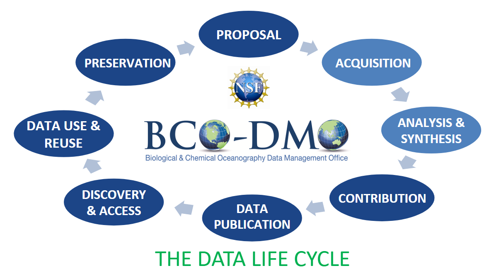

Basics of Data Management
=====================================
Open Data
~~~~~~~~~~
The inherent value that data hold to the research process cannot be overstated,
and existingdata hold great potential to **accelerate scientific discovery
through reuse once shared**.

The concept of open data, data that are publicly and freely discoverable,
accessible, and reusable, has been steadily gaining momentum in the scientific
community: “Open data is like a renewable energy source: it can be reused
without diminishing its original value, and reuse creates new value.”
(Science et al., 2017).

Realizing the value of open data within the scientific research landscape,
several stakeholders from funders to journal publishers, are driving change in
the culture of data sharing (Mayernik, 2012, Costas et al., 2013; NSF17-037, 2017;
Holdren, 2013). With this shift, many digital data repositories have come
online to provide data management services that meet stakeholder needs for data
discovery and access.

However, in order for data to be reused efficiently and effectively, they must
also be **well managed and stewarded**. Here, domain-specific repositories add
great value to their community’s research data by bringing subject matter
expertise to the curation process (Lenhert, 2015; ICPSR, 2013).

Data Life Cycle
~~~~~~~~~~~~~~~~
Curating and providing open access to research data is a collaborative process.
This process may be thought of as a life cycles with data passing through
various phases. Each phase has its own associated actores, roles and critical
activities. Good data management practices are necessary for all phases, from
proposal to preservation.

FAIR principles
~~~~~~~~~~~~~~~~
BCO-DMO aligns its data stewardship philosophy with the F.A.I.R. Data
Principles [Wilkinson et al, 2016]_ , which have gained significant attention
within the data management landscape over the recent years. These principles
outline tangible practices data providers can employ to promote easier sharing
and ultimate reuse of data by both machines and humans, thereby making
them **"Findable, Accessible, Interoperable and Reusable"**.

.. [Wilkinson et al, 2016] Wilkinson, M. D., Dumontier, M., Aalbersberg, I. J.,
  Appleton, G., Axton, M., Baak, A., Blomberg, N., Boiten, J. W., da Silva Santos,
  L. B., Bourne, P. E., Bouwman, J., Brookes, A. J., Clark, T., Crosas, M.,
  Dillo, I., Dumon, O., Edmunds, S., Evelo, C. T., Finkers, R., Gonzalez-Beltran,
  A., Gray, A. J., Groth, P., Goble, C., Grethe, J. S., Heringa, J., 't Hoen, P.
  A., Hooft, R., Kuhn, T., Kok, R., Kok, J., Lusher, S. J., Martone, M. E., Mons,
  A., Packer, A. L., Persson, B., Rocca-Serra, P., Roos, M., van Schaik, R.,
  Sansone, S. A., Schultes, E., Sengstag, T., Slater, T., Strawn, G., Swertz, M.
  A., Thompson, M., van der Lei, J., van Mulligen, E., Velterop, J., Waagmeester,
  A., Wittenburg, P., Wolstencroft, K., Zhao, J., … Mons, B. (2016). The FAIR
  Guiding Principles for scientific data management and stewardship. Scientific
  data, 3, 160018. doi:10.1038/sdata.2016.18*

Persistent Identifiers
~~~~~~~~~~~~~~~~~~~~~~~
A persistent identifier is a long-lasting reference (unique character string)
to a digital resource.An identifier is a label which gives a unique name to an
entity: a person, place, or thing. Unlike URLs, which may break, a persistent
identifier reliablypoints to a digital entity.

An **ORCID** is an example of a persistent identifier for a person.

.. _ORCID: https://orcid.org/

**DOIs** (digital object identifiers) are persistent identifiers for things or
entities such as journal articles, books, and datasets. Crossref and DataCite
are the main organizations assigning DOIs for
these purposes in scholarly communication.

BCO-DMO makes use of these persistent IDs to ensure long lasting "findability"
of people and datasets.
